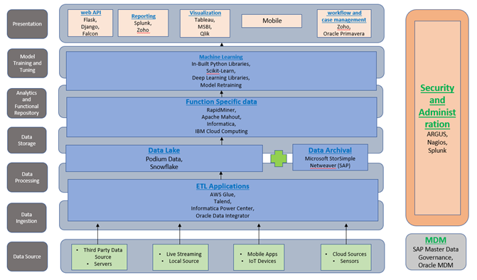

<h1 align="center">Wafer Fault Detection <h1>
 
### To build a classification methodology to predict the quality of wafer sensors based on the given training data.

  
<h2 align="center">⛩ Architecture

 
 

<h2>
 
 
 ## Problem Statement
 
The inputs of various sensors for different wafers have been provided. In electronics, a wafer (also called a slice or substrate) is a thin slice of semiconductor used for the fabrication of integrated circuits. The goal is to build a machine learning model which predicts whether a wafer needs to be replaced or not(i.e., whether it is working or not) based on the inputs from various sensors. There are two classes: +1 and -1. 
* 	+1 means that the wafer is in a working condition and it doesn’t need to be replaced.
* •	-1 means that the wafer is faulty and it needs to be replaced. 
 

##	Functional Architecture
<h1 align="center"> 


<h1>
 
 
 <h2 align="center">🛠 Technology Used <h2>
 
 ```bash
 Python
 pandas
 numpy
 sklearn
 sql(for database)
 Flask
```
<h1 align="center"> 
 
<h1>

 
